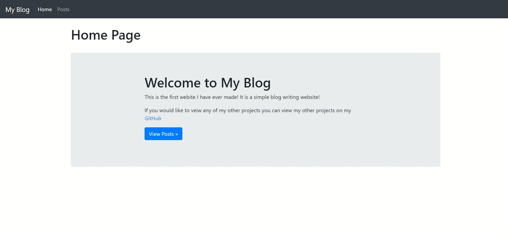
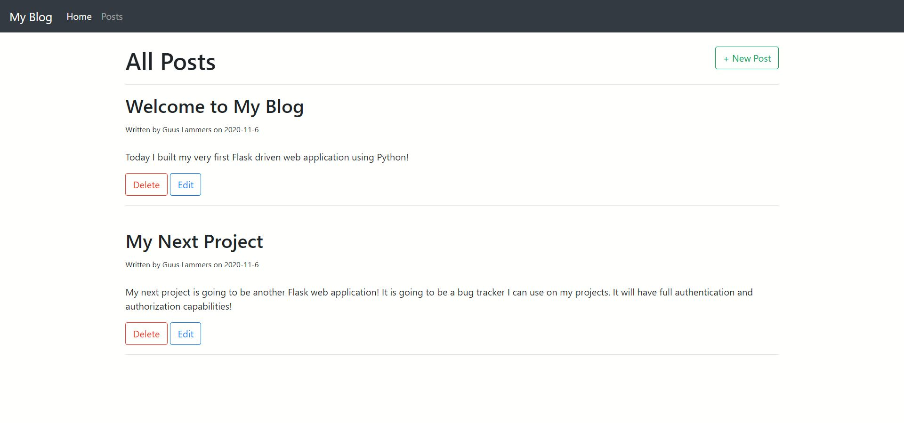
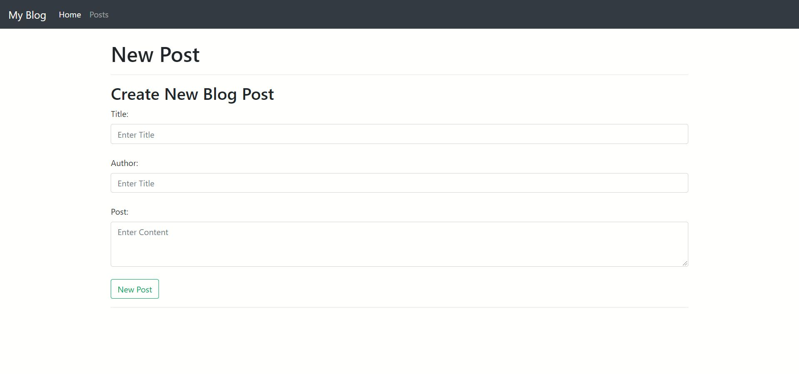
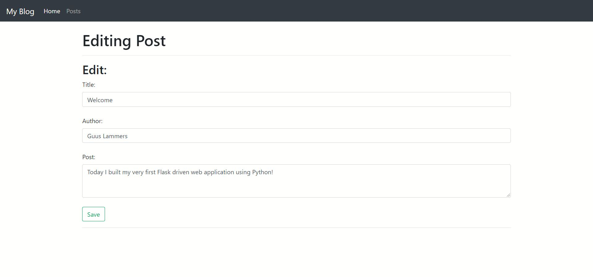

# Blog Flask Web Application
This is a Flask web application that can be used to create a blog! The application implements an SQLite databases with full CRUD functionality.

# What I Learnt
1- Worked with Flask to build backend of application. 
2- Implemented a SQLite database using SQLAlchemy with full CRUD functionality 
2- Used bootstrap for formatting purposes. 
3- Learnt how websites operate 

# User Instructions
1- To use or test out the application yourself you will first need to download all of the files in the 'Blog WebApp' folder. 
2- You will need to create a Python environment and install flask and flask_sqlalchemy so that the application can run. 
3- Run the application in the terminal and open the link in your browser. The link should look something like 'http://localhost:5000/'.
4- Once running you test you can test out the application!
# Application Pictures
1- Home Page

2- Posts Page

3- Create Post Page

4- Edit Post Page

